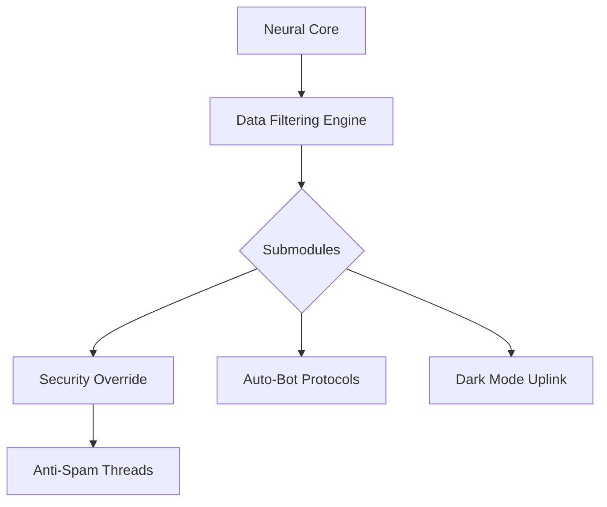

  

  

<h2 align="center">
  
  
</h2>

---

## 🧠 About Me

> "NOWHERE NEAR CODING" — still, I bend code like gravity.

- 🧬 Full Name: **Saurabh Kumar Chauhan**
- 🧠 Brain Config: **Memory High | Precision Locked | Emotions... optional**
- 🛠️ Tech Affinity: Reverse logic, system automation, intuitive pattern mapping
- 🚀 Motto: _"Dominate the system, before it dominates you."_

---

## 💾 Jarvis Stats Module

  
   
  

---

## 🔰 Current Mission

> "Build systems that build themselves."

---

## 📜 Personal Quote

> "Lie isn’t a lie until truth is revealed. Tell the truth always, but only that much which is needed — not the whole truth."

  

---

## ⚡ System Protocols Online

  

  

---

  

