<div align="center">

<!-- Header with animated banner -->


<!-- Animated typing effect -->


<!-- Profile views counter with style -->


</div>

---

## 🧬 **Neural Profile Analysis**

<table>
<tr>
<td width="50%">

### 🎯 **Core Identity**
```yaml
Name: Saurabh Kumar Chauhan
Status: Active Developer
Brain_Config: 
  - Memory: High Performance
  - Precision: Locked & Loaded
  - Emotions: Optional Module
  - Logic: Reverse Engineering
```

### 🚀 **Mission Statement**
> *"Dominate the system, before it dominates you."*

</td>
<td width="50%">

### 🛠️ **Tech Arsenal**
- 🔧 System Automation
- 🧠 Pattern Recognition
- 🔒 Security Protocols
- 🤖 Bot Development
- 🌐 Web Technologies

### 💡 **Philosophy**
> *"Truth is a weapon. Use it wisely."*

</td>
</tr>
</table>

---

## 📊 **Neural Performance Metrics**

<div align="center">


<!-- Streak stats -->


</div>

---

## 🔥 **Tech Stack Matrix**

<div align="center">

### **Languages & Frameworks**


### **Tools & Platforms**


### **Databases & Cloud**


</div>

---

## 🎯 **Neural Architecture Flow**

```mermaid
flowchart TD
    A[🧠 SAURABH Neural Core] --> B[🔍 Signal Processing]
    B --> C{🎛️ System Modules}
    C --> D[🛡️ Security Layer]
    C --> E[🤖 AutoBot Engine]
    C --> F[🌙 Dark Mode Sync]
    C --> G[⚡ Performance Optimizer]
    
    D --> H[🔒 Silent Shield]
    E --> I[🚀 Deployment Ready]
    F --> J[🎨 UI Enhancement]
    G --> K[📊 Real-time Analytics]
    
    style A fill:#00fff9,stroke:#000,color:#000
    style C fill:#ff6b6b,stroke:#000,color:#fff
    style H fill:#4ecdc4,stroke:#000,color:#000
    style I fill:#45b7d1,stroke:#000,color:#fff
    style J fill:#96ceb4,stroke:#000,color:#000
    style K fill:#feca57,stroke:#000,color:#000
```



---

## 🏆 **Achievement Unlocked**

<div align="center">

<!-- GitHub Trophies -->


</div>

---

## 📈 **Neural Activity Graph**

<div align="center">

<!-- Contribution graph -->


</div>

---

## 🌐 **Neural Network Connections**

<div align="center">

[](https://github.com/SAURABHKUMARCHAUHAN1203)
[](https://linkedin.com/in/saurabh-kumar-chauhan)
[](https://twitter.com/saurabh_dev)
[](https://instagram.com/saurabh.dev)
[](https://t.me/saurabh_dev)

</div>

---

## 💭 **Neural Wisdom**

<div align="center">

> ### *"Lie isn't a lie until truth is revealed."*
> ### *"Tell the truth always, but only that much which is needed — not the whole truth."*


</div>

---

## 🐍 **Neural Activity Visualization**

<div align="center">

<!-- Snake animation -->


</div>

---

## 📊 **System Status**

<div align="center">

<!-- Activity Stats -->


</div>

---

<div align="center">

<!-- Footer wave -->


### 🚀 **"System Ready. Neural Interface Active. Let's Code the Future."**

<!-- Visitor counter -->


</div>
